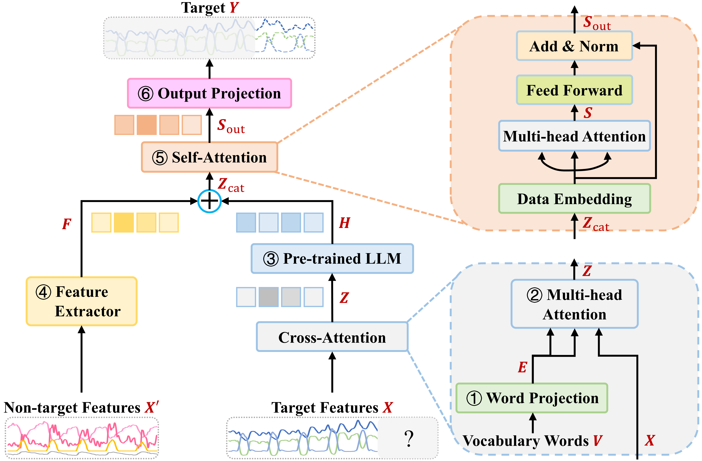

# MultiAttLLM: Multi-Attention LLM for Energy Demand Forecasting

This repository contains the official implementation of the paper **"MultiAttLLM: Multi-Attention Large Language Model for Energy Demand and Generation Forecasting"**.

## Overview

MultiAttLLM is a novel architecture that combines Large Language Models (LLMs) with multi-head cross-attention mechanisms for time series forecasting. The model leverages pre-trained LLM knowledge through a reprogramming approach to improve long-term electricity demand and renewable energy generation forecasting.

## Key Features

- **LLM Integration**: Supports GPT-2, BERT, LLAMA (1b/3b/8b), and Qwen models
- **Cross-Attention Reprogramming**: Aligns time series patches with LLM token embeddings
- **Multi-variate Forecasting**: Handles multiple target variables with covariate features
- **Long-horizon Prediction**: Designed for 7-day (168-hour) forecasting horizons

## Architecture

```
Input → Normalization → Cross Attention → [LLM Encoder (target) + Transformer Encoder (covariates)]
      → self-Attention Fusion → Output Projection → Predictions
```


## Requirements

- Python 3.8+
- PyTorch 1.12+
- Transformers (Hugging Face)
- NumPy, Pandas, Scikit-learn

## Installation

```bash
pip install torch transformers numpy pandas scikit-learn matplotlib
```

## Usage

### Training

```bash
python run_long_term_forecast.py
```

### Configuration

Key parameters in `configs/electricity_configs.py`:
- `seq_len`: Input sequence length (default: 72)
- `pred_len`: Prediction horizon (default: 168)
- `llm_model`: LLM backbone (GPT2/BERT/LLAMA/QWEN)
- `llm_layers`: Number of LLM layers to use

### Hyperparameters

Model-specific hyperparameters are in `setup_MultiAttLLM.py`.

## Dataset

The model is evaluated on electricity demand datasets from multiple regions:
- Tokyo, Kyushu, Hokkaido, Tohoku (Japan)

- 
Data should be placed in `dataset/electricity/` directory.

## Citation

If you find this work useful, please cite our paper:

```bibtex
@article{hu2025novel,
  title={A novel attention-enhanced LLM approach for accurate power demand and generation forecasting},
  author={Hu, Zehuan and Gao, Yuan and Sun, Luning and Mae, Masayuki},
  journal={Renewable Energy},
  pages={123465},
  year={2025},
  publisher={Elsevier}
}
```


## Related Papers

- [LLMformer (Probabilistic Forecasting)](../paper/LLMformer)
- [ImputeLLM (Time Series Imputation)](../paper/ImputeLLM)
