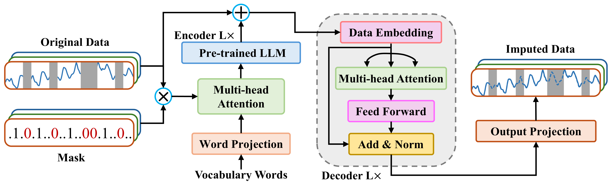
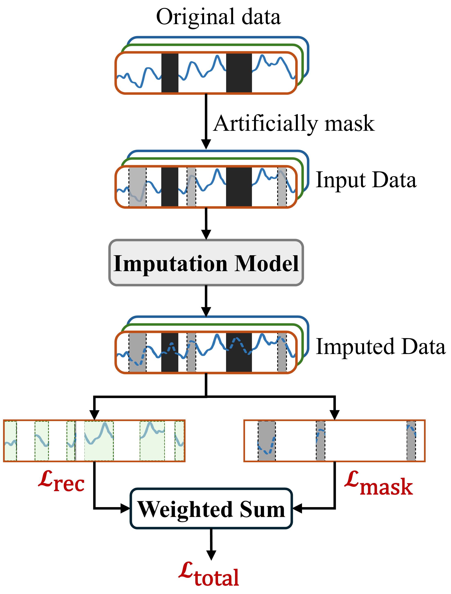

# ImputeLLM: Time Series Imputation with Large Language Models

This repository contains the official implementation of the paper **"ImputeLLM: Large Language Model Enhanced Time Series Imputation"**.

## Overview

ImputeLLM is a novel architecture that leverages pre-trained Large Language Models (LLMs) for time series imputation tasks. The model uses a reprogramming approach to align time series patches with LLM token embeddings, enabling effective imputation of missing values in multivariate time series data.

## Key Features

- **LLM-based Imputation**: Leverages pre-trained knowledge from GPT-2, BERT, LLAMA, and Qwen models
- **Patch Embedding**: Converts time series into overlapping patches for processing
- **Multi-head Attention Reprogramming**: Aligns time series representations with LLM token space
- **Dynamic Prompts**: Generates statistical prompts (min, max, median, trend, lags) for context
- **Multiple Missing Patterns**: Supports MCAR, MAR, and RDO masking methods

## Proposed ImputeLLM Architecture

```
Input → Normalization → Multi-head Attention Layer
      → Fronzen LLM Layer → Data Embeddings → Transformer Decoder
      → Output Projection → Denormalization → Imputed Output
```


## Proposed adaptive hybrid loss function


## Requirements

- Python 3.8+
- PyTorch 1.12+
- Transformers (Hugging Face)
- NumPy, Pandas, Scikit-learn

## Installation

```bash
pip install torch transformers numpy pandas scikit-learn matplotlib
```

## Usage

### Training

```bash
python run_imputation.py
```

### Configuration

Key parameters in `configs/HVAC_configs.py`:
- `seq_len`: Input sequence length (default: 48)
- `mask_rate`: Missing value ratio (0.1 - 0.5)
- `mask_method`: Missing pattern type
  - `mcar`: Missing Completely At Random
  - `mar`: Missing At Random
  - `rdo`: Random Drop Out
- `llm_model`: LLM backbone (GPT2/BERT/LLAMA/QWEN)
- `use_prompt`: Whether to use dynamic text prompts

### Hyperparameters

Model-specific hyperparameters are in `hyparam_imputation.py`.

## Dataset

The model is evaluated on the HVAC dataset:
- 25 feature columns
- 4 target variables: Total_Power, Total_Chiller_Power, System_Energy_Efficiency, Total_Cooling_Capacity
- 15-minute intervals (2023-2024)


## Missing Data Patterns

The model supports three types of missing data patterns:

1. **MCAR (Missing Completely At Random)**: Each value has equal probability of being missing
2. **MAR (Missing At Random)**: Missingness depends on observed values

## Evaluation Metrics

- MAE (Mean Absolute Error)
- MSE (Mean Squared Error)
- RMSE (Root Mean Squared Error)

## Citation

If you find this work useful, please cite our paper:

```bibtex
@article{imputellm2024,
  title={ImputeLLM: Large Language Model Enhanced Time Series Imputation},
  author={},
  journal={},
  year={2024}
}
```

## Related Papers

- [MultiAttLLM (Energy Forecasting)](../paper/MultiAttLLM)
- [LLMformer (Probabilistic Forecasting)](../paper/LLMformer)
